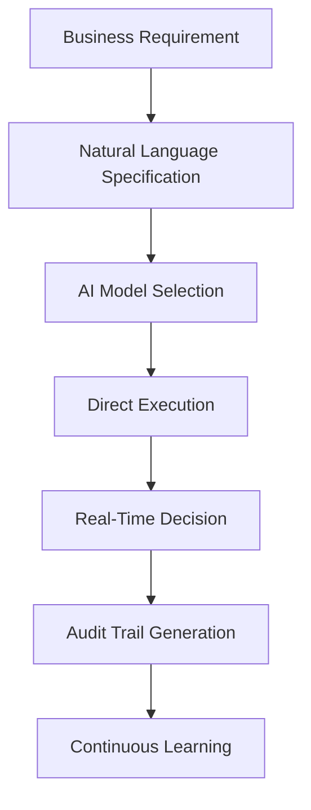
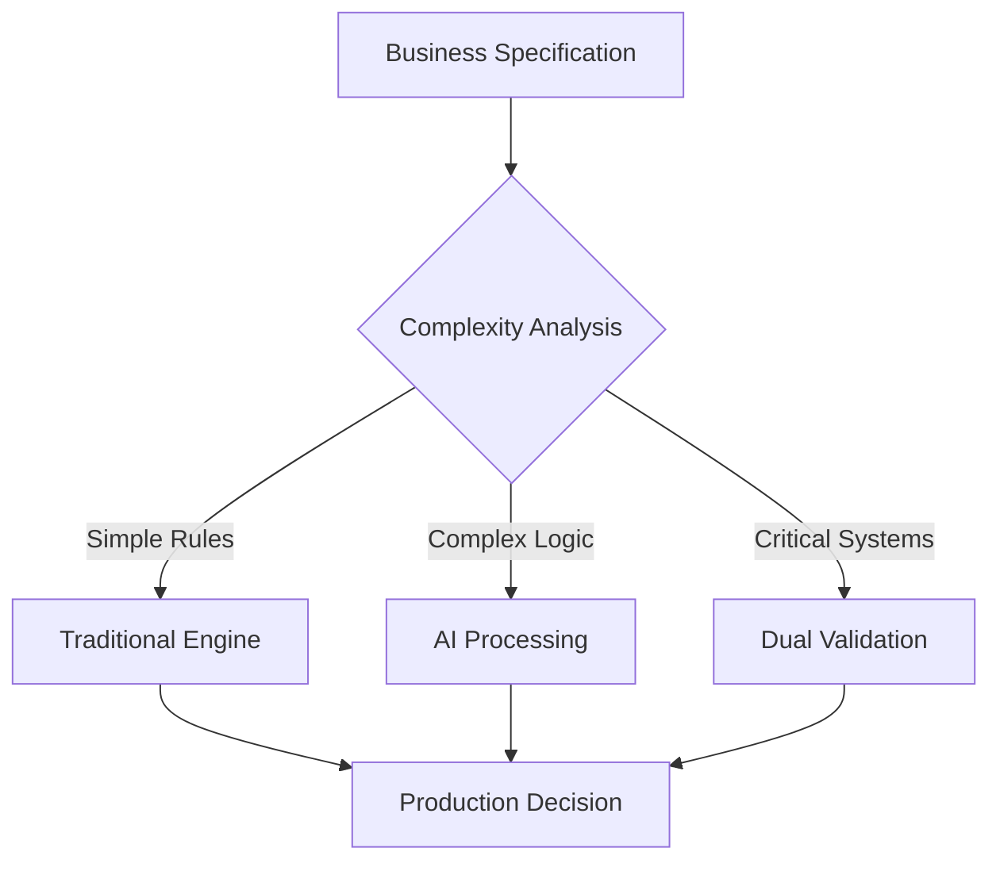
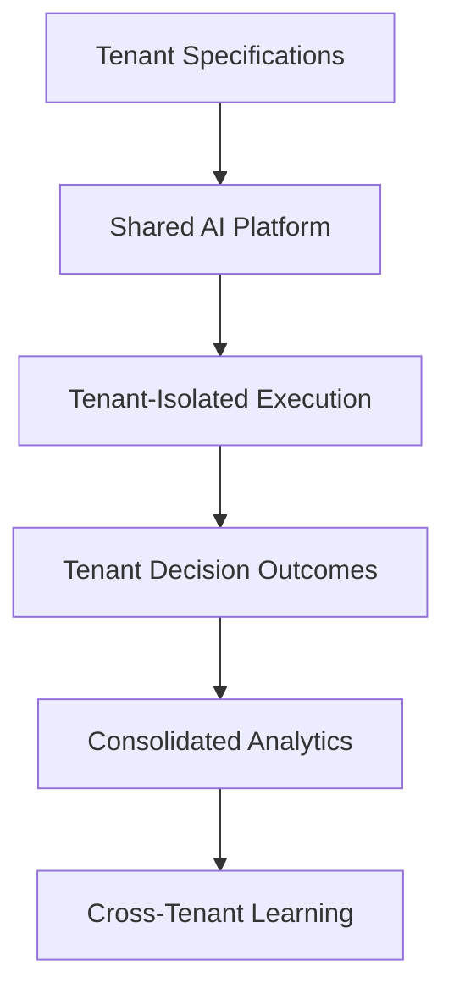

# Flow Chatmode for GitHub Copilot

AI-powered GitHub Copilot chatmode that transforms natural language business requirements into executable decision workflows. Create, test, and deploy sophisticated decision logic using natural language specifications, Gherkin DSL, YAML notation, and JSON schemas.

## Overview

The Flow chatmode transforms GitHub Copilot into an expert Systems Architect and Process Designer, capable of generating **natural language specifications as the primary capability** that serve as the single source of truth for all business logic and decision workflows. It supports **quadruple output formats**: authoritative natural language specifications (`.spec.md`), executable Gherkin DSL (`.feature`) files, structured YAML Decision Graph Notation (`.dgn.yaml`) files, and JSON Schema definitions (`.json`) - providing comprehensive approaches for modeling conditional logic, state transitions, and MCP tool orchestration with **revolutionary AI-native execution** capabilities that can replace traditional DMN and microservice approaches.

## Key Features

### 🎯 **Natural Language Specification Generation** (Primary Capability)
- **AI-Native Decision Logic**: Create comprehensive `.spec.md` files using structured English descriptions that serve as the authoritative source for all business rules, decision logic, and workflow requirements
- **Single Source of Truth**: Natural language specifications drive all implementations, serve as definitive documentation, and enable direct AI execution without code generation
- **Business Accessibility**: Non-technical stakeholders can understand, review, modify, and validate decision logic without requiring programming knowledge or specialized tools
- **Revolutionary DMN Alternative**: Modern approach that can significantly reduce or eliminate the need for complex DMN engines, specialized tools, and traditional decision management platforms
- **Multi-Format Generation**: Convert specifications to `.feature`, `.dgn.yaml`, `.json` formats, or execute directly with AI interpretation
- **Advanced Specification Features**: Complete business context documentation, state object schema design, decision logic architecture, integration mapping, performance specifications, and compliance frameworks

### 🤖 **AI-Powered Decision Execution** (Core Innovation)
- **Multi-LLM Compatibility**: Direct execution using GPT-4, Claude, Llama, Mistral, CodeLlama, Gemini, and other large language models
- **No Code Required**: Execute complex business logic immediately using AI interpretation of natural language specifications without compilation, deployment, or runtime environments
- **Contextual Intelligence**: AI can consider edge cases, handle ambiguous inputs, apply business judgment, and adapt to exceptional circumstances beyond explicitly coded rules
- **Real-time Processing**: Process decision requests immediately without traditional development cycles - ideal for prototyping, development, and specialized production scenarios
- **Learning and Adaptation**: AI execution can improve decision accuracy through pattern recognition while maintaining consistency with core business rules
- **Dynamic Rule Interpretation**: Understand complex business rules, mathematical expressions, conditional logic, probabilistic reasoning, and contextual decision-making

### ⚙️ **Multi-Format Implementation Generation**
- **Quadruple Format Output**: Generate natural language specifications (`.spec.md`), Gherkin (`.feature`) files, structured YAML (`.dgn.yaml`) decision graphs, and JSON Schema definitions (`.json`)
- **Selective Code Generation**: Create traditional implementations strategically - only for performance-critical, high-volume, or strict compliance-required scenarios
- **Three Node Types**: Decision nodes (conditional logic), End nodes (terminal states), Chance nodes (probabilistic selection)

## Strategic Implementation Approaches

### 1. **AI-First Development Strategy** (Recommended)
**Primary Use Case**: Complex, low-to-medium volume business decisions requiring nuanced interpretation

**Implementation Pattern:**
```
Business Requirement → Natural Language Specification → Direct AI Execution → Production Deployment
```

**Advantages:**
- **Immediate Value**: Business logic becomes operational instantly without development sprints
- **Business Agility**: Domain experts can modify decision logic without technical dependencies
- **Adaptive Intelligence**: AI can handle edge cases and contextual nuances beyond traditional rule engines
- **Regulatory Responsiveness**: Rapidly adapt to changing compliance requirements through specification updates
- **Cost Efficiency**: Eliminate development overhead for specialized or infrequently-used decision logic

**Optimal Scenarios:**
- Claims processing with complex medical necessity determinations
- Underwriting decisions requiring contextual business judgment
- Regulatory compliance with evolving requirements
- Customer service escalation with nuanced scenario handling
- Risk assessment incorporating multiple qualitative factors

### 2. **Hybrid Architecture Pattern** (Enterprise Scale)
**Primary Use Case**: Mixed workloads requiring both AI flexibility and high-performance execution

**Implementation Pattern:**
```
Natural Language Specification → AI + Traditional Implementation → Smart Routing → Production Deployment
```

**Architecture Benefits:**
- **Performance Optimization**: Use traditional implementations for high-volume, predictable scenarios
- **Intelligent Fallback**: Leverage AI for complex edge cases that exceed traditional rule coverage
- **Gradual Migration**: Start with AI execution, then selectively optimize with traditional implementations
- **Risk Management**: Maintain traditional implementations as fallback for critical business processes
- **Stakeholder Alignment**: Satisfy both business accessibility and technical performance requirements

### 3. **Traditional Implementation Generation** (High-Volume Scenarios)
**Primary Use Case**: High-frequency, performance-critical decisions with well-defined business rules

**Implementation Pattern:**
```
Natural Language Specification → Code Generation → Traditional Deployment → Performance Optimization
```

**Use Cases:**
- Real-time payment processing with millisecond latency requirements
- High-frequency trading decisions with strict performance constraints  
- IoT device decision processing with resource limitations
- Batch processing of millions of transactions with consistent logic
- Mission-critical systems requiring deterministic execution patterns

## Additional Capabilities

### 🔍 **Enhanced Decision Graph Evaluation**
- **Multi-Format Execution**: Evaluate natural language specifications using AI interpretation, `.feature` files using Gherkin logic, and `.dgn.yaml` files using structured processing
- **Advanced Input Processing**: Intelligent type inference, validation, context enrichment, and automatic format detection
- **Interactive Testing**: Execute decision graphs with specified inputs to see complete traversal paths with detailed reasoning and alternative route analysis
- **Enhanced Visualization**: ASCII diagrams, flowchart representations, and interactive visualizations showing execution flow, decision points, and probability distributions
- **Performance Analysis**: Execution time measurement, resource utilization profiling, and optimization recommendations
- **Comprehensive Test Reports**: Generate `.spec.tests.md`, `.feature.tests.md` and `.dgn.tests.md` evaluation reports with quality scoring and business rule validation

### ⚡ **Production-Ready Output**
- **Mandatory Validation**: 3-iteration improvement cycle ensures production readiness
- **Comprehensive Testing**: Built-in test case generation and validation
- **Error Handling**: Complete error recovery and edge case coverage
- **Performance Optimization**: Efficient tool selection and parallel execution capabilities
- **State-Driven Architecture**: Comprehensive state object management throughout workflow execution with advanced validation and tracking
- **MCP Tool Integration**: Seamless integration with Model Context Protocol tools for external system interaction and orchestration
- **Organized File Structure**: Automatic storage in `features/flows/` with intelligent naming conventions and comprehensive test report generation
- **Performance Optimization**: Efficient tool selection and parallel execution capabilities

## Installation

### 1. Add Flow Chatmode to VS Code

Place the Flow chatmode definition in your VS Code workspace:

```
.github/
└── chatmodes/
    └── Flow.chatmode.md
```

### 2. Enable in VS Code Settings

Add to your VS Code settings or workspace configuration:

```json
{
  "github.copilot.chat.modes": [
    ".github/chatmodes/Flow.chatmode.md"
  ]
}
```

### 3. Restart VS Code

After adding the chatmode file, restart VS Code to load the new chatmode.

## Getting Started

### Basic Usage

1. **Open Copilot Chat** in VS Code
2. **Select Flow Mode** from the chatmode dropdown
3. **Request a Flow**: Describe your workflow requirements

```
Create a user authentication flow with password reset and account lockout
```

### Advanced Usage

**Generate with Specific Requirements:**
```
Create an e-commerce order processing flow with inventory validation, 
payment processing, fraud detection, and shipping coordination
```

**Request Specific Output Format:**
```
Generate a user authentication flow in YAML format with account lockout 
and password reset capabilities
```

**Evaluate Natural Language Specifications:**
```
Evaluate the health-insurance-claim-flow specification for input:
claim_type='emergency',
claim_amount=15000,
policy_status='active',
member_tier='premium'
```

**Generate Natural Language Specifications:**
```
Create a natural language specification for an e-commerce order processing 
flow with inventory validation, payment processing, fraud detection, 
and shipping coordination
```

## AI-Powered Decision Processing

### Revolutionary Approach to Decision Management

The Flow chatmode introduces **AI-native decision processing** as the primary methodology that revolutionizes traditional decision management and can significantly replace or complement DMN-based and microservice approaches:

#### 🤖 **Advanced Direct AI Execution**
- **Multi-LLM Compatibility**: Large language models (GPT-4, Claude, Llama, Mistral, CodeLlama, Gemini, and emerging LLMs) can directly interpret and execute natural language specifications
- **Zero Code Deployment**: Process complex business decisions without generating, compiling, testing, or deploying traditional code implementations
- **Real-time Intelligence**: Execute sophisticated business logic immediately using AI interpretation of natural language rules with contextual understanding
- **Adaptive Processing**: AI can consider edge cases, handle ambiguous inputs, apply business judgment, and adapt to exceptional circumstances beyond explicitly programmed rules
- **Continuous Learning**: AI execution can improve decision accuracy through pattern recognition and experience-based refinement while maintaining consistency with core business rules
- **Enterprise Scalability**: Support for high-complexity, judgment-based decisions that traditional rule engines struggle to handle effectively

#### 📈 **Superior Advantages over Traditional Approaches**

**vs. DMN (Decision Model and Notation):**
- **Business Accessibility**: Business users can read, understand, and modify specifications without learning DMN syntax, FEEL expressions, or specialized modeling tools
- **Cost Revolution**: Eliminates expensive DMN modeling tools, specialized training, consulting services, and complex licensing arrangements
- **Development Velocity**: Modify business logic directly in natural language without model regeneration, testing cycles, or deployment procedures
- **Vendor Independence**: Not locked into specific DMN vendors, proprietary tools, or platform dependencies
- **Simplified Governance**: Version control and change management through readable text documents instead of complex model files
- **Reduced Technical Debt**: No complex DMN table structures, FEEL expressions, or modeling tool dependencies to maintain

**vs. Traditional Microservices:**
- **Development Acceleration**: Create, test, and modify specifications in hours vs. weeks/months for coded implementations
- **Infrastructure Elimination**: No containers, orchestration, databases, load balancers, or runtime environments for basic decision execution
- **Operational Simplification**: Eliminates microservice complexity including service mesh, monitoring, logging, and deployment pipelines
- **Maintenance Efficiency**: Business rule changes don't require coding, code reviews, testing cycles, or deployment procedures
- **Resource Optimization**: Dramatically lower compute, memory, and infrastructure costs compared to full microservice implementations
- **Architectural Simplification**: Reduces system complexity, integration points, failure modes, and operational overhead

#### 🏗️ **Advanced Hybrid Architecture Benefits**
- **Intelligent Scaling**: Start with AI execution for rapid prototyping and complex decisions, selectively generate traditional implementations for high-volume scenarios based on actual usage patterns
- **Performance Optimization**: Use AI for complex, judgment-based decisions and generated code for high-frequency, deterministic operations
- **Risk Mitigation**: Maintain parallel execution capabilities during transitions with seamless fallback mechanisms
- **Technology Evolution**: Specifications remain technology-agnostic and can generate implementations in new languages and frameworks as technology advances
- **Business Continuity**: Zero-downtime migrations and rollback capabilities ensure continuous operation during architecture evolution

#### ⚖️ **Strategic Decision Framework**

**AI-Powered Execution (Optimal for):**
- Complex decision logic requiring contextual understanding and business judgment
- Prototyping and development phases requiring rapid iteration
- Infrequent high-value decisions where accuracy and adaptability matter more than raw performance
- Regulatory environments requiring explainable decision reasoning
- Cost-sensitive environments minimizing infrastructure investment
- Innovation scenarios testing new business models and processes

**Traditional Implementation (Consider for):**
- Ultra-high volume processing (millions of decisions per second)
- Microsecond latency requirements for real-time systems
- Deterministic compliance environments requiring bit-perfect reproducibility
- Legacy integration with existing decision management platforms
- Scenarios where AI execution costs exceed traditional infrastructure costs

#### 🔬 **Advanced Quality Assurance and Governance**
- **Specification Clarity Standards**: Well-structured natural language specifications produce more reliable and consistent AI execution
- **Comprehensive Testing Frameworks**: Multi-scenario validation with automated quality scoring and business rule compliance checking
- **Dual Execution Validation**: Automated comparison between AI execution and traditional implementations for critical decision paths
- **Confidence Scoring**: AI execution includes confidence levels and reasoning transparency for governance and audit requirements
- **Continuous Monitoring**: Real-time tracking of AI decision patterns with anomaly detection and consistency validation

## Decision Graph Notation

The Flow chatmode supports four powerful formats for modeling decision graphs, with natural language specifications as the primary format:

### 1. Natural Language Specification Format (`.spec.md` files) - **Primary Format**

Comprehensive business logic documentation that serves as the single source of truth and authoritative specification:

#### **Complete Business Context Documentation**

**Example Specification Structure:**

```
# Business Process Decision Flow Specification

## Document Information
- **Flow Name**: [Process Name] Decision Flow
- **Version**: 1.0
- **Specification Type**: Natural Language Decision Graph Specification
- **Target Formats**: Gherkin (.feature), YAML Decision Graph Notation (.dgn.yaml), JSON Schema (.json)

## Business Context
### Purpose
The [Process Name] automates the evaluation and processing of [business domain]
through a comprehensive decision graph that handles [key capabilities including
fraud detection, manual review processes, and automated approvals].

### Business Objectives
1. **Automation**: Minimize manual intervention while ensuring accuracy and compliance
2. **Risk Management**: Detect and investigate potentially problematic cases
3. **Compliance**: Ensure all processing meets policy and regulatory requirements
4. **Efficiency**: Process requests within defined service level agreements
5. **Customer Experience**: Provide clear communication and timely resolution

### System Prerequisites
- Workflow engine initialized and operational
- Model Context Protocol (MCP) tool registry available
- Required MCP tools configured (semantic_search, file_search, create_file, etc.)
- External system dependencies accessible and validated
```

#### **Comprehensive State Object Schema**

**Example State Object Definition:**

```javascript
state = {
  // Business Entity Identification  
  entity_id: string,
  entity_type: enum["priority", "standard", "bulk"],
  entity_amount: number,
  processing_date: date,
  
  // Business Context
  context_id: string,
  context_status: enum["active", "inactive", "suspended"],
  context_tier: enum["standard", "premium", "enterprise"],
  
  // Processing Management
  validation_status: string,
  processing_priority: enum["low", "standard", "medium", "high", "urgent", "immediate"],
  workflow_stage: string,
  
  // Decision Logic State
  decision_criteria: object,
  business_rules_applied: array,
  compliance_status: string,
  risk_assessment: object
}
```

#### **Detailed Decision Node Definitions**

**Example Node Definition:**

```
### 1. Initial Processing Node (entity-intake)
**Type**: Decision Node
**Context**: ["validation", "initial_processing", "business_rules"]
**Purpose**: Process initial entity submission and route to appropriate processing path

**Input Criteria**:
- Entity type (priority, standard, bulk)
- Entity amount (with business thresholds: ≤$1,000, ≤$10,000, >$10,000)
- Context status (active, inactive, suspended)
- Context tier (standard, premium, enterprise)

**Decision Logic**:
1. **Priority High-Value Processing** (amount > $10,000, priority type, active context, premium+ tier)
   - Execute semantic_search for priority validation and risk assessment
   - Set validation_status = "requires_priority_review"
   - Set processing_priority = "high"
   - Apply business rules: [high_value_verification, enhanced_due_diligence]
   - Transition to: priority-review
   - Probability: 1.0
   - Business Rationale: High-value priority items require enhanced scrutiny

2. **Standard Processing** (amount ≤ $10,000, standard type, active context)
   - Execute file_search for standard eligibility validation
   - Set validation_status = "standard_processing_eligible"
   - Set processing_priority = "standard"
   - Apply business rules: [standard_verification, basic_compliance_check]
   - Transition to: standard-processing
   - Probability: 0.9
   - Business Rationale: Standard items follow streamlined processing path
```

#### **Advanced Business Rules and Integration Requirements**

**Business Rules and Constraints:**

```
## Business Rules and Constraints
### Processing Rules
1. **Priority items** must be processed within 4 hours during business days
2. **Standard items** must be processed within 48 hours
3. **Risk assessment** is mandatory for items over $50,000
4. **Manual review** is required for complex cases or unusual patterns

### Integration Requirements
- **Policy Administration System**: Real-time status verification
- **Risk Assessment Service**: Automated scoring and pattern analysis  
- **Compliance Platform**: Regulatory requirement validation
- **Notification System**: Automated stakeholder communication

## Performance Requirements
### Processing Targets
- **Priority items**: 95% processed within 4 hours
- **Standard items**: 90% processed within 48 hours
- **System availability**: 99.9% uptime for core processing
```

#### **Advanced AI Execution Framework**

**Primary Deployment Strategy: Direct AI Processing**

Flow chatmode's revolutionary capability enables immediate execution of business logic directly from natural language specifications, eliminating traditional development cycles:

**AI Execution Guidelines:**

**Model Selection Criteria:**
- **Complex Business Logic**: GPT-4, Claude 3.5 Sonnet for nuanced interpretation
- **High-Volume Decisions**: Llama 3.1, Mistral for efficient processing
- **Specialized Domains**: Domain-fine-tuned models when available
- **Hybrid Processing**: Combine multiple models for validation and consensus

**Execution Commands:**

**Primary Command Pattern:**
```
@copilot /flow execute [specification-name].spec.md with state=[state_object]
```

**Advanced Execution Options:**
```
@copilot /flow execute health-insurance-claim.spec.md 
  with state={claim_type="emergency", claim_amount=15000, member_tier="premium"}
  using model=gpt-4 
  explain_reasoning=true 
  generate_audit_trail=true
```

**AI Interpretation Capabilities:**
- **Contextual Reasoning**: Understand business scenarios beyond explicit rules
- **Exception Handling**: Apply business judgment to edge cases and anomalies
- **Regulatory Compliance**: Interpret evolving compliance requirements dynamically
- **Stakeholder Communication**: Generate clear explanations for decision outcomes
- **Performance Optimization**: Learn from execution patterns to improve efficiency

**Quality Assurance Protocols:**
1. **Multi-Model Validation**: Compare decisions across different AI models
2. **Business Stakeholder Review**: Enable domain experts to validate AI reasoning
3. **Historical Consistency**: Track decision patterns for regulatory audit compliance
4. **Performance Monitoring**: Measure execution time, accuracy, and business impact
5. **Continuous Improvement**: Refine specifications based on real-world outcomes

### 2. Gherkin DSL Format (`.feature` files)

Uses Gherkin DSL with specialized conventions to create Decision Graph Notation:

#### **Examples Tables as Decision Tables**
```gherkin
Examples: Decision table name
  | input:state.property | output:state.property | mcp_tool:name | probability | transition |
  | user_input_value    | calculated_output     | semantic_search | 0.8 | next-scenario |
```

#### **Node Type Annotations**
```gherkin
@flow:decision_node     # Conditional logic with deterministic routing
@flow:end_node          # Terminal states (empty transition column)
@flow:chance_node       # Probabilistic selection when multiple rows match
```

#### **State Object Management**
```gherkin
@scenario_id:unique-identifier
Scenario Outline: Process State Transition
  Given current state contains <input:state.property>
  When condition <input:state.criteria> is evaluated
  Then execute tool <mcp_tool:name>
  And update state to <output:state.result>
  And transition to <transition>
```

### 3. YAML Decision Graph Notation (`.dgn.yaml` files)

Structured YAML format for complex decision graphs:

```yaml
metadata:
  name: "Business Process Decision Flow"
  description: "Automated decision logic for business process"
  version: "1.0"
  created: "2025-11-02"
  type: "decision_graph_notation"

context:
  background:
    description: "Business Process Context"
    prerequisites:
      - workflow_engine_initialized: true
      - mcp_tool_registry_available: true
      - required_tools_configured: true

nodes:
  - node:
      id: "process-intake"
      type: "decision_node"
      context: ["validation", "processing"]
      description: "Process Initial Request"
      scenario:
        Given:
          - a new request with type <input__state.request_type>
          - request priority is <input__state.priority>
        When:
          - the system validates the request
        Then:
          - it should execute tool <mcp_tool__name>
          - set validation status to <output__state.validation_status>
          - transition to <transition>
      decision_table:
        name: "Request processing decision table"
        columns:
          - "input__state.request_type"
          - "input__state.priority"
          - "mcp_tool__name"
          - "mcp_tool__output_sample"
          - "output__state.validation_status"
          - "probability"
          - "transition"
        rows:
          - "input:state.request_type": "urgent"
            "input:state.priority": "high"
            "mcp_tool:name": "semantic_search"
            "mcp_tool:output_sample": '{"validation": "approved", "priority": "immediate"}'
            "output:state.validation_status": "approved"
            "probability": 1.0
            "transition": "priority-processing"

workflow_execution:
  start_node: "process-intake"
  state_management:
    initial_state: {}
    state_transitions: true
    state_persistence: true
```

### 4. JSON Schema Format (`.json` files)

Structured JSON Schema definitions for API integrations, data validation, and system interoperability:

```json
{
  "$schema": "http://json-schema.org/draft-07/schema#",
  "title": "Business Process Decision Flow Schema",
  "type": "object",
  "properties": {
    "flowMetadata": {
      "type": "object",
      "properties": {
        "name": { "type": "string" },
        "description": { "type": "string" },
        "version": { "type": "string" },
        "businessDomain": { "type": "string" }
      },
      "required": ["name", "description", "version"]
    },
    "stateSchema": {
      "type": "object",
      "properties": {
        "entity_id": { "type": "string", "pattern": "^[A-Z]{3}-[0-9]{6}$" },
        "entity_type": { 
          "type": "string", 
          "enum": ["priority", "standard", "bulk"] 
        },
        "entity_amount": { 
          "type": "number", 
          "minimum": 0,
          "maximum": 1000000 
        },
        "processing_status": {
          "type": "string",
          "enum": ["pending", "processing", "approved", "denied", "review"]
        },
        "business_rules": {
          "type": "array",
          "items": { "type": "string" }
        }
      },
      "required": ["entity_id", "entity_type", "entity_amount"]
    },
    "decisionNodes": {
      "type": "array",
      "items": {
        "type": "object",
        "properties": {
          "nodeId": { "type": "string" },
          "nodeType": { 
            "type": "string", 
            "enum": ["decision", "end", "chance"] 
          },
          "inputCriteria": { "type": "object" },
          "outputActions": { "type": "object" },
          "transitionRules": { "type": "object" }
        },
        "required": ["nodeId", "nodeType"]
      }
    },
    "businessRules": {
      "type": "object",
      "properties": {
        "processingTimeouts": {
          "type": "object",
          "properties": {
            "priority": { "type": "string", "pattern": "^[0-9]+[hm]$" },
            "standard": { "type": "string", "pattern": "^[0-9]+[hm]$" }
          }
        },
        "validationRules": {
          "type": "array",
          "items": {
            "type": "object",
            "properties": {
              "ruleName": { "type": "string" },
              "condition": { "type": "string" },
              "action": { "type": "string" }
            }
          }
        }
      }
    }
  },
  "required": ["flowMetadata", "stateSchema", "decisionNodes"]
}
```

### File Organization Structure

```
features/flows/
├── process-name.spec.md              # Natural language specification (Primary - Source of Truth)
├── process-name.feature              # Gherkin behavioral specification
├── process-name.dgn.yaml            # Structured decision graph notation
├── process-name.json                # JSON schema definition
├── process-name.spec.tests.md       # Natural language evaluation report
├── process-name.feature.tests.md    # Gherkin evaluation report
├── process-name.dgn.tests.md        # YAML evaluation report
└── process-name.json.tests.md       # JSON schema validation report
```

**Implementation Strategy:**
1. **Primary Development**: Start with `.spec.md` natural language specification as single source of truth
2. **Format Generation**: Create supporting `.feature`, `.dgn.yaml`, and `.json` formats from specification
3. **AI Execution**: Use GitHub Copilot Chat with Flow chatmode for direct specification processing
4. **Validation**: Maintain consistency across all four formats through automated testing

### Decision Table Columns (All Formats)

| Column Type | Natural Language | Gherkin Format | YAML Format | JSON Schema | Purpose |
|------------|------------------|---------|-------------|-------------|---------|
| **Input State** | Property descriptions | `<input:state.property_name>` | `input__state.property_name` | `"inputSchema"` | Drive decision logic |
| **Output State** | Result specifications | `<output:state.property_name>` | `output__state.property_name` | `"outputSchema"` | Update workflow state |
| **MCP Tool** | Tool descriptions | `<mcp_tool:name>` | `mcp_tool__name` | `"mcpToolRef"` | Tool to execute for this path |
| **Mock Output** | Sample results | `<mcp_tool:output_sample>` | `mcp_tool__output_sample` | `"mockOutput"` | Sample output for testing |
| **Probability** | Selection weights | `<probability>` | `probability` | `"probability"` | Selection weight (0.0-1.0) |
| **Transition** | Next step logic | `<transition>` | `transition` | `"transition"` | Next scenario ID (empty for End nodes) |

## Flow Chatmode Capabilities

### 1. **AI-Powered Natural Language Specification Processing**
- **Primary Capability**: Execute business decisions directly from natural language specifications
- **Multi-LLM Support**: Compatible with GPT-4, Claude, Llama, Mistral, CodeLlama, Gemini, and other advanced models
- **Single Source of Truth**: Natural language specifications (`.spec.md`) serve as authoritative documentation
- **Business Accessibility**: Enable non-technical stakeholders to create and modify decision logic
- **Real-Time Execution**: Process specifications without compilation or deployment steps
- **Context-Aware Processing**: Understand business context, regulatory requirements, and operational constraints

### 2. **Quadruple Format Generation & Management**
- **Complete Format Suite**: Generate natural language (`.spec.md`), Gherkin (`.feature`), YAML (`.dgn.yaml`), and JSON Schema (`.json`) formats
- **Intelligent Conversion**: Automatically translate between formats while maintaining business logic integrity
- **Format-Specific Optimization**: Tailor output for intended use cases (documentation, testing, integration)
- **State Management Excellence**: Comprehensive state object design with validation rules
- **Tool Integration**: Optimal MCP tool assignment based on business requirements
- **Cross-Format Consistency**: Maintain synchronization across all format representations

### 3. **Enterprise-Grade Validation Protocol**
Every generated flow undergoes a rigorous multi-iteration improvement cycle:

1. **Initial Generation**: Create comprehensive flow based on business requirements
2. **First Enhancement**: Review for completeness, optimization, and regulatory compliance
3. **Second Enhancement**: Analyze edge cases, performance optimization, and scalability
4. **Final Validation**: Production readiness review with security and integration testing
5. **Continuous Improvement**: Monitor real-world performance and iteratively refine

**Validation Dimensions:**
- **Business Logic Accuracy**: Verify alignment with business requirements and policies
- **Regulatory Compliance**: Ensure adherence to industry standards and regulations
- **Performance Optimization**: Validate execution efficiency and resource utilization
- **Security Assessment**: Review for data protection and access control requirements
- **Integration Compatibility**: Test compatibility with existing systems and tools

### 4. **Advanced Testing & Quality Assurance**
- **Multi-Format Validation**: Test natural language specifications, Gherkin features, YAML graphs, and JSON schemas
- **Comprehensive Scenario Coverage**: Validate every decision path and business rule
- **Edge Case Engineering**: Test boundary conditions, error scenarios, and exceptional cases
- **Integration Testing**: Verify MCP tool compatibility and external system interactions
- **Performance Benchmarking**: Analyze execution time, resource usage, and scalability metrics
- **Regression Testing**: Ensure changes don't break existing functionality
- **Business Stakeholder Validation**: Enable domain experts to verify business logic accuracy
- **Automated Test Generation**: Create test suites from natural language specifications

### **Enterprise Architecture Patterns**

#### **Pattern 1: AI-First Decision Architecture**


**Implementation:**
- **Primary Flow**: Business specs → AI execution → Production decisions
- **Governance**: Specification review → AI model validation → Decision monitoring
- **Optimization**: Pattern recognition → Specification refinement → Performance improvement

#### **Pattern 2: Hybrid Decision Engine Architecture**


**Architecture Benefits:**
- **Performance Optimization**: Route simple decisions to high-speed traditional engines
- **Intelligence Application**: Use AI for complex scenarios requiring business judgment
- **Risk Management**: Dual validation for critical business decisions
- **Scalability**: Independent scaling of AI and traditional processing components

#### **Pattern 3: Multi-Tenant Decision Management**


**Enterprise Features:**
- **Specification Isolation**: Separate natural language specifications per tenant/business unit
- **Model Customization**: Fine-tuned AI models for specific business domains
- **Compliance Segregation**: Industry-specific regulatory requirements and audit trails
- **Performance Analytics**: Business unit performance comparison and optimization recommendations

### 5. **AI-Powered Decision Graph Execution**
When evaluating flows with specified inputs:

- **Multi-Format Execution**: Process natural language specifications, Gherkin features, YAML graphs, and JSON schemas
- **Primary AI Execution**: Direct interpretation and execution from natural language specifications using advanced LLMs
- **Intelligent State Management**: Dynamic state object creation and property initialization
- **Contextual Decision Making**: AI-powered analysis of business context and decision criteria
- **Step-by-Step Reasoning**: Detailed explanation of decision logic and path selection
- **Visual Flow Representation**: Generate ASCII diagrams and execution flowcharts
- **Alternative Analysis**: Explore other possible execution routes and outcomes
- **Comprehensive Reporting**: Create detailed evaluation reports across all formats (`.spec.tests.md`, `.feature.tests.md`, `.dgn.tests.md`, `.json.tests.md`)
- **Business Impact Assessment**: Analyze decisions for business value and operational efficiency
- **Performance Monitoring**: Track execution time, resource usage, and decision accuracy

## Example: Health Insurance Claim Processing

### Generated Flow Structure (Gherkin Format)
```gherkin
Feature: Health Insurance Claim Processing Decision Flow
  As a health insurance system
  I want to process claims through automated decision logic
  So that claims are efficiently evaluated and processed

@flow:decision_node
@scenario_id:claim-intake
Scenario Outline: Process Initial Claim Intake
  Given a new claim is submitted with claim type <input:state.claim_type>
  And claim amount is <input:state.claim_amount>
  When the intake system validates the claim
  Then it should execute tool <mcp_tool:name>
  And transition to <transition>

  Examples: Claim intake decision table
    | input:state.claim_type | input:state.claim_amount | mcp_tool:name | probability | transition |
    | emergency | state.claim_amount > 10000 | semantic_search | 1.0 | priority-review |
    | routine | state.claim_amount <= 5000 | file_search | 0.9 | eligibility-check |
    | preventive | state.claim_amount <= 1000 | create_file | 1.0 | auto-approval |
```

### Generated Flow Structure (YAML Format)
```yaml
metadata:
  name: "Health Insurance Claim Processing Decision Flow"
  description: "Automated decision logic for health insurance claim processing"
  version: "1.0"
  type: "decision_graph_notation"

nodes:
  - node:
      id: "claim-intake"
      type: "decision_node"
      context: ["claim_validation", "initial_processing"]
      description: "Process Initial Claim Intake"
      decision_table:
        name: "Claim intake decision table"
        columns:
          - "input__state.claim_type"
          - "input__state.claim_amount"
          - "mcp_tool__name"
          - "probability"
          - "transition"
        rows:
          - "input:state.claim_type": "emergency"
            "input:state.claim_amount": "state.claim_amount > 10000"
            "mcp_tool:name": "semantic_search"
            "probability": 1.0
            "transition": "priority-review"

workflow_execution:
  start_node: "claim-intake"
  state_management:
    initial_state: {}
    state_transitions: true
```

### Test Case Examples

**Evaluate Natural Language Specification:**
```
Evaluate the health-insurance-claim-flow specification for input: 
claim_type='emergency', 
claim_amount=15000, 
policy_status='active', 
member_tier='premium'
```

**Evaluate Gherkin Implementation:**
```
Evaluate the health-insurance-claim-flow.feature for input: 
claim_type='emergency', 
claim_amount=15000, 
policy_status='active', 
member_tier='premium'
```

**Evaluate YAML Implementation:**
```
Evaluate the health-insurance-claim-flow.dgn.yaml for input: 
claim_type='emergency', 
claim_amount=15000, 
policy_status='active', 
member_tier='premium'
```

### Natural Language Specification Foundation

Flow chatmode's revolutionary approach prioritizes natural language specifications as the **primary execution format**, enabling direct AI-powered decision processing without traditional compilation or deployment steps.

**Example Natural Language Specification:**

```
# Health Insurance Claim Processing Flow Specification

## Business Context
### Purpose
The Health Insurance Claim Processing Flow leverages AI-powered decision engines to automate 
the evaluation, validation, and processing of health insurance claims through intelligent 
business logic that adapts to complex scenarios, regulatory requirements, and operational constraints.

### Strategic Advantages
- **Direct AI Execution**: Process specifications immediately using advanced language models
- **Business Stakeholder Empowerment**: Enable domain experts to modify decision logic without technical expertise
- **Regulatory Agility**: Rapidly adapt to changing compliance requirements through natural language updates
- **Operational Transparency**: Provide clear audit trails and decision explanations in human-readable format

### Business Objectives
1. **Intelligent Automation**: Leverage AI to minimize manual intervention while maximizing accuracy
2. **Adaptive Fraud Prevention**: Use machine learning patterns to detect and investigate suspicious claims
3. **Dynamic Compliance**: Ensure real-time adherence to evolving policy and regulatory requirements
4. **Performance Excellence**: Process claims within aggressive service level agreements using AI optimization
5. **Customer Experience**: Provide transparent communication and predictable resolution timelines

### AI-Enhanced Processing Capabilities
- **Contextual Decision Making**: Understand nuanced business scenarios beyond simple rule-based logic
- **Predictive Analytics**: Anticipate processing bottlenecks and resource requirements
- **Natural Language Explanation**: Generate human-readable justifications for all decisions
- **Continuous Learning**: Improve decision accuracy through feedback and outcome analysis

## Comprehensive State Object Schema

```javascript
state = {
  // Core Claim Identification
  claim_id: string,
  claim_type: enum["emergency", "routine", "preventive", "specialist", "chronic_care", "mental_health"],
  claim_amount: number,
  
  // Policy & Member Context  
  policy_status: enum["active", "inactive", "suspended", "pending"],
  member_tier: enum["standard", "premium", "enterprise", "government"],
  member_history: object,
  
  // AI Processing State
  validation_status: enum["pending", "validated", "flagged", "requires_review"],
  processing_priority: enum["immediate", "urgent", "high", "standard", "low"],
  ai_confidence_score: number,
  
  // Business Intelligence
  fraud_risk_assessment: object,
  regulatory_compliance_status: string,
  business_rules_applied: array,
  decision_audit_trail: array
}
```

### File Structure Generated

```
features/flows/
├── health-insurance-claim-flow.spec.md         # Natural language specification (Primary)
├── health-insurance-claim-flow.feature         # Gherkin behavioral specification  
├── health-insurance-claim-flow.dgn.yaml       # Structured decision graph
├── health-insurance-claim-flow.json           # JSON schema definition
├── health-insurance-claim-flow.spec.tests.md  # Natural language evaluation report
├── health-insurance-claim-flow.feature.tests.md # Gherkin evaluation report
├── health-insurance-claim-flow.dgn.tests.md   # YAML evaluation report
└── health-insurance-claim-flow.json.tests.md  # JSON schema validation report
```

**Multi-Format Execution Strategy:**
- **Primary**: Direct AI processing of natural language specification
- **Supporting**: Gherkin for behavioral testing, YAML for structured analysis, JSON for system integration
- **Validation**: Comprehensive testing across all formats to ensure consistency
- **Evolution**: Update all formats simultaneously as business requirements change

### Expected Evaluation Output
```
┌─────────────────────┐    ┌─────────────────────┐    ┌─────────────────────┐
│ @claim-intake       │───▶│ @priority-review    │───▶│ @payment-approval   │
│ (Decision)          │    │ (Decision)          │    │ (End)               │
│ p=1.0, row=1        │    │ p=1.0, row=1        │    │ Terminal Node       │
│ semantic_search     │    │ semantic_search     │    │ create_file         │
└─────────────────────┘    └─────────────────────┘    └─────────────────────┘

Execution Summary:
- Total Steps: 3 nodes traversed
- Tools Used: semantic_search (2x), create_file (1x)
- Final Status: Emergency claim approved and paid
- Processing Time: ~2 minutes (emergency fast-track)
```

## Governance & Compliance Framework

### **AI Decision Governance**

#### **Regulatory Compliance Management**

**Compliance Architecture:**

**Industry-Specific Requirements:**
- **Healthcare (HIPAA, HITECH)**: Protected health information handling in claims processing
- **Financial Services (SOX, GDPR)**: Audit trails and decision transparency for regulatory review
- **Insurance (NAIC Guidelines)**: Claims processing fairness and anti-discrimination compliance
- **Government (FISMA, FedRAMP)**: Security standards and access control for decision systems

**AI Governance Framework:**
1. **Model Transparency**: Document AI model selection criteria and decision reasoning methods
2. **Decision Auditability**: Maintain comprehensive audit trails for all AI-powered decisions
3. **Bias Detection**: Monitor decision patterns for potential bias and discriminatory outcomes
4. **Performance Monitoring**: Track decision accuracy, processing time, and business impact metrics
5. **Human Oversight**: Define escalation procedures for complex decisions requiring human review

#### **Enterprise Security & Access Control**

**Security Framework:**

**Access Management:**
- **Role-Based Permissions**: Specify who can create, modify, and execute decision specifications
- **Specification Versioning**: Track all changes to business logic with approval workflows
- **Environment Segregation**: Separate development, testing, and production decision processing
- **Data Classification**: Categorize business data sensitivity and apply appropriate protection measures

**AI Model Security:**
- **Model Validation**: Verify AI model integrity and prevent model poisoning attacks
- **Input Sanitization**: Protect against adversarial inputs designed to manipulate AI decisions
- **Output Validation**: Verify AI decision outputs meet business logic constraints and expectations
- **Fallback Mechanisms**: Ensure traditional decision logic availability during AI system failures

#### **Quality Assurance & Performance Management**

**Quality Framework:**

**Decision Quality Metrics:**
- **Accuracy Rate**: Percentage of AI decisions that align with expected business outcomes
- **Consistency Score**: Variance in decisions for similar business scenarios over time
- **Compliance Rate**: Adherence to regulatory requirements and business policy constraints
- **Appeal Success Rate**: Percentage of AI decisions overturned during manual review processes

**Performance Optimization:**
- **Execution Efficiency**: Monitor AI processing time and resource utilization patterns
- **Scalability Testing**: Validate performance under various load conditions and complexity scenarios
- **Cost Management**: Track AI model usage costs and optimize model selection for cost-effectiveness
- **Business Impact Analysis**: Measure decision quality impact on business outcomes and customer satisfaction

## Advanced AI-Powered Features

### Natural Language Expression Processing
Flow chatmode leverages advanced language models to interpret sophisticated business logic expressions directly from natural language:

**Business Rule Expressions:**
- Calculate benefit amount as "80% of submitted amount, capped at policy maximum"
- Set priority as "urgent if emergency and high-value member, otherwise standard"
- Determine approval as "auto-approve if routine care under $1000 and member in good standing"

**AI-Enhanced Decision Logic:**
- "Approve claim if medical necessity is established and provider is in-network, otherwise require manual review"
- "Route to specialist if complex condition detected, considering member history and clinical guidelines"
- "Apply fraud detection algorithms if claim pattern matches suspicious indicators"

**Dynamic Calculation Processing:**
- "Calculate final benefit as minimum of policy limit and 80% of allowed amount"
- "Adjust deductible based on member tier and year-to-date spending"
- "Apply co-insurance rules considering in-network vs out-of-network status"

### AI-Powered Probabilistic Decision Making
Intelligent routing based on contextual analysis and machine learning patterns:

**Load Balancing with AI Optimization:**
When system load exceeds normal capacity:
- Route 70% of standard claims to primary processing queue (high confidence decisions)
- Route 20% of complex claims to specialist review team (requires human expertise)  
- Route 10% of flagged claims to fraud investigation unit (suspicious patterns detected)
- Dynamically adjust percentages based on real-time performance metrics

### Intelligent Parallel Execution Patterns
AI-coordinated concurrent processing workflows:

```
## Parallel Decision Processing
Execute multiple business rules simultaneously:
- Medical necessity verification (async)
- Provider network validation (async) 
- Member eligibility confirmation (async)
- Fraud risk assessment (async)
- Regulatory compliance check (sync - blocking)
- Final benefit calculation (sync - depends on all async results)
@scenario_id:concurrent-validation
Examples: Parallel validation processes
  | validation_type | mcp_tool:name | sync_mode | transition |
  | security_check | semantic_search | async | security-results |
  | compliance_check | file_search | async | compliance-results |
  | business_rules | create_file | sync | rule-validation |
```

**Parallel Decision Processing Example:**
Execute multiple business rules simultaneously:
- Medical necessity verification (async)
- Provider network validation (async) 
- Member eligibility confirmation (async)
- Fraud risk assessment (async)
- Regulatory compliance check (sync - blocking)
- Final benefit calculation (sync - depends on all async results)

## AI-First Best Practices

### 1. **Natural Language Specification Excellence**
- **AI-Native Development**: Design specifications for direct AI execution as the primary deployment strategy
- **Business Stakeholder Empowerment**: Write specifications that domain experts can modify without technical intervention
- **Contextual Completeness**: Include comprehensive business context, regulatory requirements, and operational constraints
- **Single Source Authority**: Treat `.spec.md` files as the definitive business logic repository
- **Iterative Refinement**: Use AI feedback to continuously improve specification clarity and completeness
- **Semantic Precision**: Use precise business terminology that AI models can interpret accurately

### 2. **Multi-Format Strategy & Architecture**
- **Primary Format**: Natural language specifications for AI execution and business accessibility
- **Supporting Formats**: Generate Gherkin (`.feature`), YAML (`.dgn.yaml`), and JSON (`.json`) for specific use cases
- **Format Synchronization**: Maintain consistency across all formats through automated validation
- **Deployment Flexibility**: Support both AI-powered execution and traditional implementation deployment
- **Stakeholder Alignment**: Choose formats based on audience needs (business users, developers, systems integrators)
- **Evolution Management**: Update all formats simultaneously as business requirements change

### 3. **AI-Enhanced Decision Architecture**
- **Contextual Decision Making**: Design specifications that enable AI to understand nuanced business scenarios
- **Adaptive Logic**: Create decision frameworks that can evolve with changing business conditions
- **Explainable Decisions**: Structure specifications to enable clear AI-generated explanations
- **Performance Optimization**: Balance decision complexity with execution efficiency requirements
- **Continuous Learning**: Incorporate feedback mechanisms for ongoing decision improvement
- **Hybrid Execution**: Combine AI interpretation with traditional rule engines where appropriate

### 4. **Enterprise Testing Strategy**
- **Multi-Format Validation**: Test AI execution of natural language specifications alongside traditional format testing
- **Business Logic Verification**: Validate AI interpretation matches intended business outcomes  
- **Stakeholder Acceptance**: Enable business users to verify AI decision explanations
- **Performance Benchmarking**: Compare AI execution performance against traditional implementations
- **Edge Case Engineering**: Test complex scenarios where AI interpretation might vary
- **Regression Protection**: Ensure specification changes don't break existing decision patterns
- **Integration Validation**: Verify AI-powered decisions integrate properly with existing systems

### 5. **Production Deployment Excellence**
- **AI Execution Strategy**: Deploy natural language specifications for direct AI processing in appropriate scenarios
- **Hybrid Architecture**: Combine AI-powered decisions with traditional implementations based on requirements
- **Documentation**: Maintain clear flow documentation and test cases
- **Monitoring**: Implement execution tracking and performance monitoring appropriate for chosen execution method
- **Versioning**: Use proper version control for flow updates
- **Hybrid Architecture**: Consider combining AI execution for development/testing with traditional implementations for production when needed

## Common Use Cases

### Business Process Automation
- **Approval Workflows**: Multi-level approval processes with conditional routing
- **Customer Onboarding**: Identity verification, document processing, account setup
- **Order Processing**: Inventory, payment, fulfillment, and shipping coordination
- **Support Ticket Routing**: Priority-based assignment with escalation paths

### System Integration
- **API Orchestration**: Sequential and parallel API call coordination
- **Data Pipeline Management**: ETL processes with error handling and retry logic
- **Microservice Coordination**: Service mesh communication patterns
- **Event-Driven Architecture**: Event processing and reaction workflows

### Decision Support Systems
- **Risk Assessment**: Credit scoring, fraud detection, compliance checking
- **Resource Allocation**: Load balancing, capacity planning, optimization
- **Content Management**: Publishing workflows, review processes, archival
- **Quality Assurance**: Testing pipelines, validation processes, certification

## Troubleshooting

### Common Issues

**Flow Not Loading:**
- Verify `.github/chatmodes/Flow.chatmode.md` file exists
- Check VS Code settings include the chatmode path
- Restart VS Code after adding the chatmode

**Evaluation Errors:**
- Ensure all required input properties are provided
- Verify state property names match decision table columns (check both formats)
- Check that scenario IDs in transitions exist in the flow
- Validate file extensions match evaluation format (.feature vs .dgn.yaml)

- **Performance Monitoring**: Continuously monitor AI execution performance and decision accuracy
- **Rollback Strategy**: Maintain traditional implementations as fallback for critical business processes
- **Validation Framework**: Implement comprehensive validation before production deployment
- **Stakeholder Training**: Ensure business users understand AI-powered decision capabilities

## Troubleshooting & Optimization

### AI Execution Issues
**Problem**: AI misinterprets business logic from natural language specifications
**Solutions:**
- Enhance specification clarity with more precise business terminology
- Add contextual examples and edge cases to specifications
- Use consistent language patterns across similar business scenarios
- Validate AI interpretation through iterative testing and refinement

**Problem**: Inconsistent decisions across multiple AI executions
**Solutions:**
- Increase specification detail and remove ambiguous language
- Add explicit decision criteria and thresholds
- Include comprehensive business context and constraints
- Use deterministic expressions where consistency is critical

### Performance Optimization Strategies
**AI-Powered Execution:**
- Optimize natural language specification complexity for faster AI processing
- Use caching for repeated decision patterns and common scenarios
- Consider pre-computed decision trees for high-frequency scenarios
- Monitor AI model performance and adjust specification complexity accordingly

**Multi-Format Performance:**
- Review decision table complexity across all formats
- Optimize MCP tool selection based on execution frequency
- Consider parallel execution opportunities for independent decision paths
- Validate state object size and processing efficiency

### Business Logic Validation
**Specification Accuracy Issues:**
- Conduct stakeholder reviews of natural language specifications
- Cross-validate AI decisions against expected business outcomes
- Implement A/B testing between AI and traditional implementations
- Create comprehensive test scenarios covering edge cases and exceptions

### Integration & Deployment Challenges
**System Integration:**
- Verify MCP tool compatibility and availability
- Test AI execution in target deployment environment
- Validate performance under expected load conditions
- Ensure proper error handling and fallback mechanisms

### Getting Help & Support

**AI-Powered Flow Development:**
- Provide comprehensive business context and regulatory requirements
- Specify target audience (business users vs. technical implementers)
- Include complete business rules, edge cases, and exception handling
- Request specific AI execution capabilities and performance requirements
- Share existing decision documentation or legacy system specifications

**Natural Language Specification Issues:**
- Describe intended business logic in detail with specific examples
- Include context about stakeholder requirements and constraints
- Provide sample decision scenarios with expected outcomes
- Specify business domain terminology and industry-specific requirements
- Request guidance on AI-optimized specification structure

**Multi-Format Generation & Synchronization:**
- Specify which formats are needed (natural language, Gherkin, YAML, JSON)
- Indicate primary use case for each format (AI execution, testing, integration)
- Include stakeholder requirements for format accessibility
- Request validation strategies for maintaining format consistency
- Provide existing format examples for reference

**Evaluation & Testing Support:**
- Share complete business scenario inputs and expected decision outcomes
- Include performance requirements and scale expectations
- Provide existing system behavior for comparison validation
- Specify testing environment constraints and requirements
- Request comprehensive evaluation report examples

## Contributing & Community

### Advancing AI-Powered Decision Management
- **Natural Language Patterns**: Develop reusable specification templates for common business domains
- **AI Execution Optimization**: Contribute techniques for improving AI interpretation accuracy and performance  
- **Multi-Format Innovation**: Enhance synchronization and validation across natural language, Gherkin, YAML, and JSON formats
- **Business Domain Expertise**: Share industry-specific decision patterns and regulatory compliance frameworks
- **Integration Strategies**: Develop hybrid architectures combining AI execution with traditional implementations

### Technology Enhancement Opportunities
- **Advanced AI Capabilities**: Integrate newer language models and reasoning techniques
- **Performance Analytics**: Develop metrics and monitoring for AI-powered decision systems
- **Visualization Tools**: Create advanced flow visualization and decision audit capabilities
- **Quality Assurance**: Build automated validation frameworks for specification consistency
- **Enterprise Features**: Add role-based access, governance, and compliance tracking capabilities

### Knowledge Sharing & Best Practices
- **Specification Excellence**: Share techniques for writing AI-optimized natural language specifications
- **Business Stakeholder Empowerment**: Contribute training materials and workflows for non-technical users
- **Decision Pattern Libraries**: Build reusable collections of proven business decision patterns
- **Performance Benchmarking**: Share optimization strategies and performance comparison studies
- **Implementation Success Stories**: Document real-world deployment experiences and lessons learned

## License & AI Usage

This Flow chatmode is designed for enterprise-grade AI-powered decision management using GitHub Copilot in VS Code. 

**Key Considerations:**
- **AI Model Compliance**: Ensure compatibility with your organization's AI usage policies and approved language models
- **Business Logic Governance**: Maintain appropriate oversight for AI-driven business decision processes
- **Data Privacy**: Validate that business specifications and decision context comply with data protection requirements
- **Performance Monitoring**: Implement appropriate monitoring and validation for AI-powered decision systems
- **Fallback Strategies**: Maintain traditional implementation capabilities for critical business processes

**Recommended Usage:**
- Use for medium to high-complexity business decisions where AI interpretation adds value
- Implement appropriate human oversight for critical business outcomes
- Validate AI decisions against expected business logic through comprehensive testing
- Consider hybrid approaches combining AI interpretation with traditional rule engines where appropriate

Ensure compliance with GitHub Copilot terms of service and your organization's AI governance frameworks.

---

**Flow Chatmode Version**: 1.2  
**Compatible with**: VS Code + GitHub Copilot  
**Last Updated**: November 2, 2025  

For more examples and advanced usage patterns, see the complete Flow chatmode definition and health insurance claim processing example (including natural language specifications `.spec.md`, Gherkin `.feature`, and YAML `.dgn.yaml` formats) included in this repository.

**Key Innovation**: This chatmode introduces AI-native decision processing through natural language specifications, enabling organizations to execute complex business logic using LLM interpretation while maintaining the option to generate traditional implementations for high-performance scenarios.
